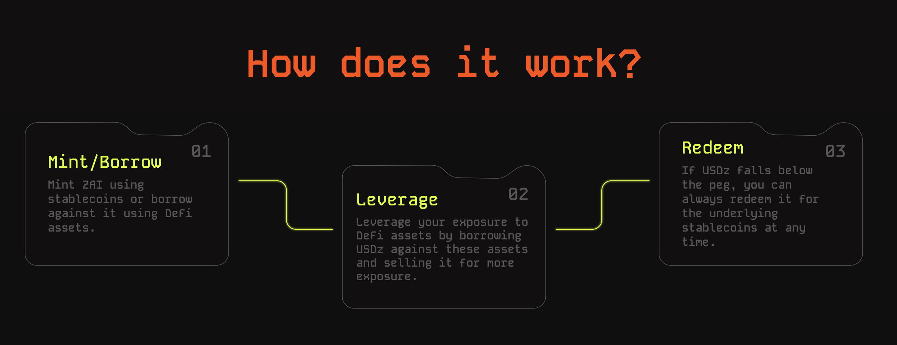

# Overview


The ZAI Stablecoin is currently deployed at:&#x20;


**ZAI (USDz)** is a decentralized stablecoin within the MAHA ecosystem designed to maintain a 1:1 peg with the US Dollar (USD). ZAI is highly scalable and over-collateralized stablecoin that can be used to leverage against crypto-native assets.

ZAI aims to provide stability and liquidity without relying on traditional liquidation mechanisms or stability pools. Users can mint ZAI against traditional stablecoins, such as USDC and DAI, and leverage ZAI in various DeFi protocols and liquidity pools.

## How does ZAI work?

<figure><figcaption></figcaption></figure>

ZAI mainly servers for two kinds of users.

* **Liquidity Providers:** Users who mint ZAI using stablecoins and provide liquidity to the ZAI/USDC pair across various DEXes. Liquidity providers earn MAHA rewards and fees earned from leverage borrowers.
* **Leverage Users:** Users who borrow ZAI to leverage themselves across various asset classes. Borrowers pay an interest fee in ZAI which goes back to liquidity providers for providing liquidity.

***

## Open Source & Decentralized&#x20;

ZAI is a decentralized stablecoin and the source code is completely open source (Under the GPL-3 license).  The source code for ZAI can be found in the below Github repo:



ZAI is also decentralized with no blacklists and ownership of the token tied to the [MAHA governance](../maha-governance/overview.md).
